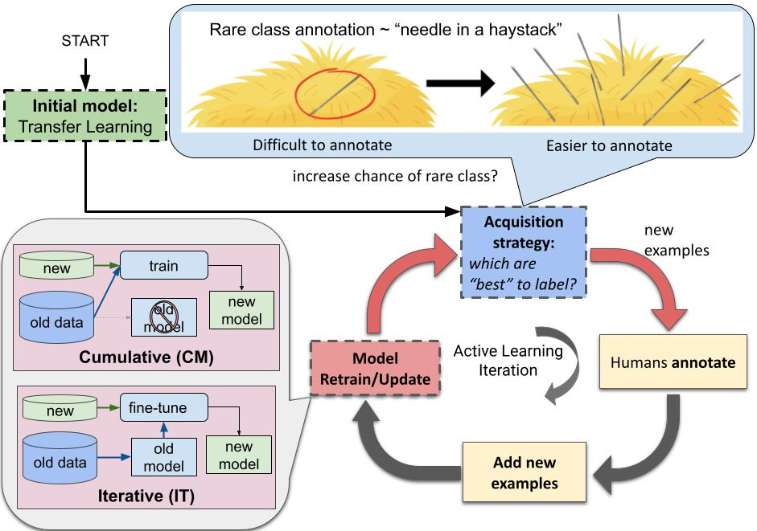

# Active Learning for Rare Class
## Details

This code accompanies the AL strategies used in our paper [Transfer and Active Learning for Dissonance Detection: Addressing the Rare Class Challenge](https://arxiv.org/abs/2305.02459). The five AL methods: 

* Random
* Entropy
* [CoreSet](https://arxiv.org/abs/1708.00489v4)
* [Contrastive Active Learning](https://aclanthology.org/2021.emnlp-main.51/)
* Probability-of-Rare-Class (PRC)

These are implemented separately from the dataset introduced in our paper so that they can be used out-of-the-box on any dataset.



The PRC approach is a simple approach that picks examples most likely to be classified as the rare class by the model in each round of the active learning loop. This helps alleviate the needle-in-haystack problem which is prevalent in cases of absolute rarity (data scarcity combined with rare classes -- leading to almost no examples being found when data is collected from scratch.)

## Setup

Ideally, use Python>=3.8.

```
pip install -r requirements.txt
```

The demo for each AL strategy can be found in demo.ipynb.

## Citation

If you use our code, please cite our paper using the following bibtex:

```

@inproceedings{varadarajan2023transfer,
    title={Transfer and Active Learning for Dissonance Detection: Addressing the Rare-Class Challenge},
    author={Varadarajan, Vasudha and Juhng, Swanie and Mahwish, Syeda and Liu, Xiaoran and Luby, Jonah and Luhmann, Christian and Schwartz, H Andrew},
    booktitle = "Proceedings of the 61st Annual Meeting of the Association for Computational Linguistics (Long Papers)",
    month = july,
    year = "2023",
    address = "Toronto, Canada",
    publisher = "Association for Computational Linguistics",
    abstract = "While transformer-based systems have enabled greater accuracies with fewer training examples, data acquisition obstacles still persist for rare-class tasks -- when the class label is very infrequent (e.g. < 5% of samples). Active learning has in general been proposed to alleviate such challenges, but choice of selection strategy, the criteria by which rare-class examples are chosen, has not been systematically evaluated. Further, transformers enable iterative transfer-learning approaches. We propose and investigate transfer- and active learning solutions to the rare class problem of dissonance detection through utilizing models trained on closely related tasks and the evaluation of acquisition strategies, including a proposed probability-of-rare-class (PRC) approach. We perform these experiments for a specific rare class problem: collecting language samples of cognitive dissonance from social media. We find that PRC is a simple and effective strategy to guide annotations and ultimately improve model accuracy while transfer-learning in a specific order can improve the cold-start performance of the learner but does not benefit iterations of active learning.",
}

```
